# Mapa do motor de diagnóstico

> Documento didático, sem jargão técnico. Objetivo: qualquer pessoa consegue abrir este arquivo e entender, do início ao fim, como o motor decide o que mostrar para o fundador — desde o clique que pede um diagnóstico até a única resposta final que ele recebe.
>
> Este mapa descreve fielmente o que o código faz hoje. Cada bifurcação aqui corresponde a uma condição real no motor (`rint-visibility`). Para a versão técnica completa (nomes de função, linhas de código, casos de teste), ver [`rint-app/docs/DIAGNOSIS-DOMINANT.md`](../../rint-app/docs/DIAGNOSIS-DOMINANT.md) e [`GEMINI-PROBE-METHODOLOGY.md`](./GEMINI-PROBE-METHODOLOGY.md).

---

## Como ler este mapa

Nos diagramas abaixo:

- **Losango** `{ }` = uma pergunta que o motor responde sozinho (sim/não).
- **Retângulo** `[ ]` = uma ação ou um resultado.
- **Retângulo com borda dupla** = um dos 4 destinos finais possíveis (a "causa da semana").

Alguns termos técnicos viram nome de negócio aqui. Tabela de tradução:

| No código | Neste mapa | O que é de verdade |
|---|---|---|
| SKU | Produto | Um produto específico sendo testado — uma URL de página de produto |
| Coerência | "A resposta bate com a loja" | Se preço/marca que a IA citou batem com o cadastro real |
| Citação / "cliente foi citado" | "A IA te citou como fonte" | A loja apareceu como referência na resposta |
| Grounding | "As fontes que a IA consultou" | Os links que o Google Search (usado pela IA) realmente leu |
| JSON-LD / schema | "Ficha técnica legível por máquina" | Um bloco de dados estruturados na página que a IA lê direto, sem precisar interpretar texto solto |
| Retrato do dia (day photo) | "Aproveitar o que já foi medido hoje" | Cache que evita perguntar a mesma coisa duas vezes no mesmo dia |
| Job | Trabalho / diagnóstico | Uma execução completa do motor, do pedido até a resposta |
| Track / trilha | Trilha | Cada uma das 4 causas possíveis da semana |
| SKU dominante | Produto da semana | O produto escolhido para representar todo o diagnóstico |

---

## 1. Visão geral — do pedido à resposta

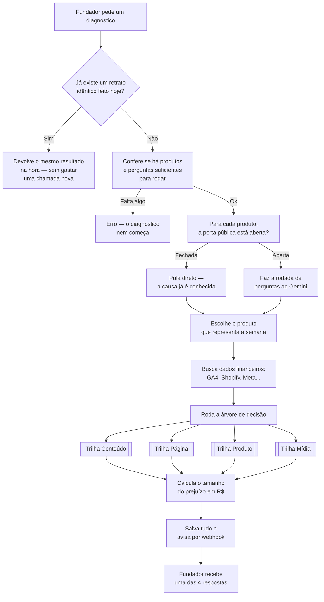

As seções a seguir abrem cada caixa deste mapa.

---

## 2. Antes de perguntar pra IA

Antes de gastar uma única chamada ao Gemini, o motor confere se vale a pena rodar de novo.

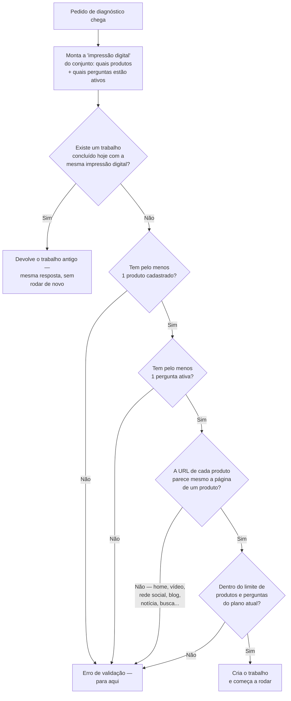

Duas ideias importantes aqui:

- **"Impressão digital" do dia** — se o fundador roda o diagnóstico duas vezes no mesmo dia (fuso de São Paulo) com exatamente o mesmo conjunto de produtos e perguntas ativas, o motor não gasta uma chamada nova: devolve o resultado que já existe. Uma pergunta nova ou um produto novo já muda a impressão digital e libera uma rodada nova.
- **Página não pode ser qualquer link.** O motor recusa colar a home da loja, um vídeo, uma rede social, um blog, uma notícia, uma página de busca ou de categoria como se fosse a página de um produto — mesmo que o texto pareça convincente, se o link não parece a página de um produto específico, o diagnóstico nem começa. Mercado Livre e Amazon são aceitos.

---

## 3. A porta da loja está aberta?

Para cada produto, antes de gastar uma pergunta com a IA, o motor confere se a página pública do produto está acessível — porque se a porta está fechada, perguntar pra IA não muda a causa: a IA também não consegue entrar.

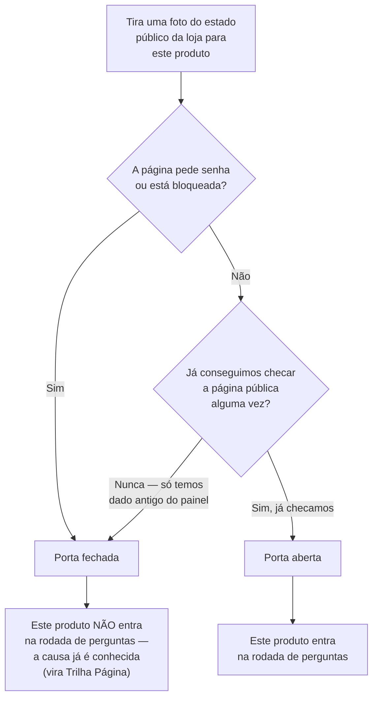

Produtos com a porta fechada pulam direto para a Trilha Página — não faz sentido gastar uma pergunta na IA quando a causa já está clara.

---

## 4. A rodada de perguntas ao Gemini

Para cada produto com a porta aberta, o motor passa por todas as perguntas cadastradas para aquele produto.

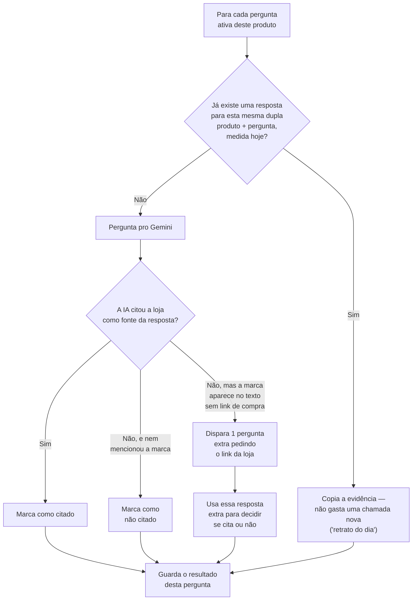

Duas regras que evitam gastar chamadas à toa:

- **Retrato do dia por dupla produto+pergunta.** Se a mesma pergunta já foi feita hoje para o mesmo produto (ignorando maiúsculas, acentos e espaços extras), o motor copia a resposta e o horário em que foi medida — não pergunta de novo.
- **Um único "puxão" de confirmação.** Se a resposta da IA menciona a marca no texto mas não mostra o link de compra da loja, o motor faz **uma** pergunta extra, direcionada, pedindo especificamente o link. Isso evita julgar "não citou" quando a IA só esqueceu de linkar.

---

## 5. Qual produto representa o diagnóstico da semana

Um diagnóstico foca em **um único produto** por rodada — mesmo que vários tenham sido testados.

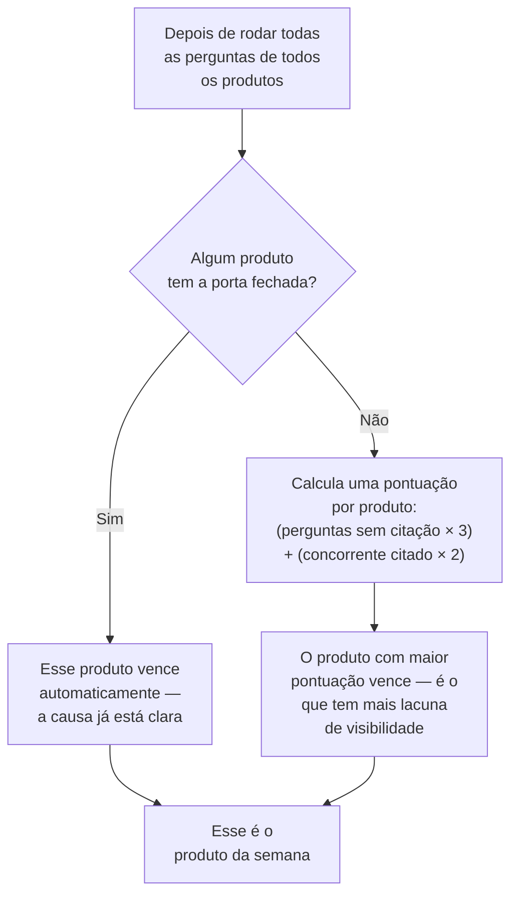

A porta fechada sempre ganha na hora — não tem por que comparar pontuação quando já sabemos que o problema é acesso.

---

## 6. A árvore de decisão — qual é a causa desta semana

Este é o núcleo do motor: uma cadeia de perguntas respondida **em ordem**. A primeira pergunta que der "sim" decide a trilha — as seguintes nem são avaliadas. Só existe **uma** causa por diagnóstico.

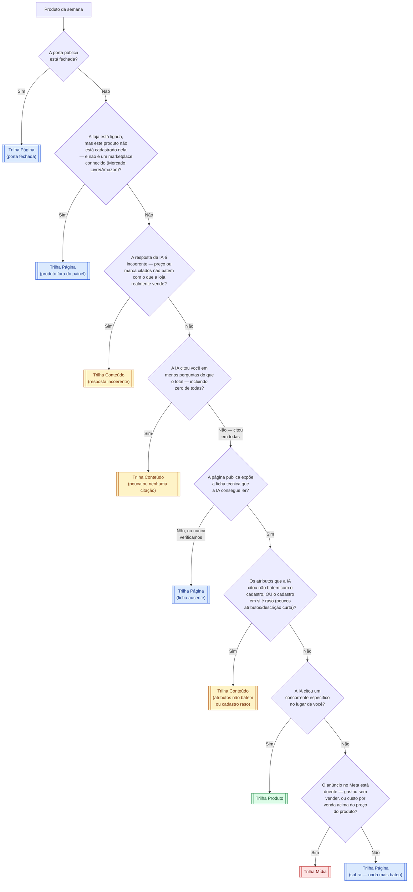

Duas notas de leitura importantes:

- **Se a IA nunca citou você em nenhuma pergunta, não existe "resposta incoerente"** — sem te citar, não tem preço nem marca pra comparar. Nesse caso a árvore pula direto da pergunta de coerência para a de "quantas vezes te citou" (que já vai dar sim, porque 0 é menos que o total).
- **"Produto antes de Mídia" é proposital.** Se a IA já citou você em todas as perguntas, a página técnica está ok, mas ela escolheu um concorrente específico, a causa é Produto — mesmo que o anúncio no Meta também esteja gastando mal. Não faz sentido aumentar a verba de um produto que a própria IA já rejeitou.

---

## 7. As 4 trilhas — o que cada uma realmente vira

Depois que a árvore escolhe a trilha, o motor monta **uma única ação da semana** — nunca uma lista de tarefas.

### 🟡 Trilha Conteúdo — "a IA não te conhece direito"

A ação sempre passa por uma pergunta primeiro: o cadastro deste produto na loja já tem informação suficiente pra sustentar um conteúdo, ou precisa ser completado antes?

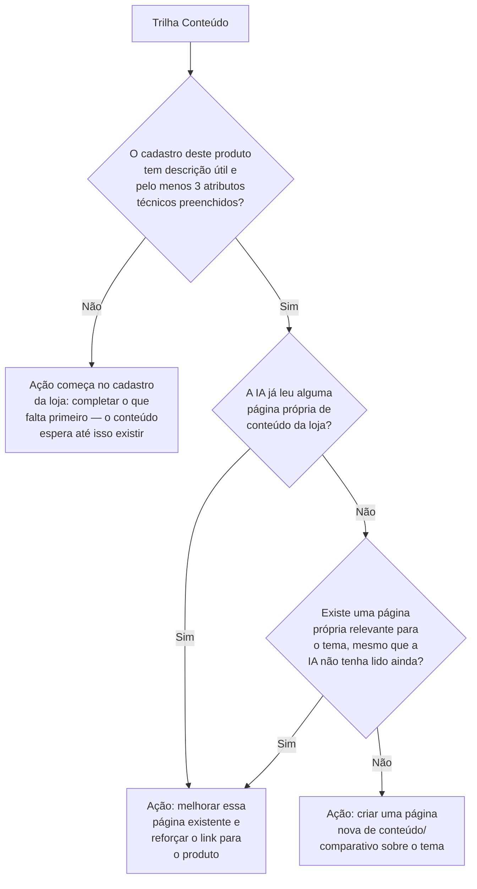

Regras que valem sempre nesta trilha:

- A ação nunca copia um atributo que o concorrente tem e a loja **não** tem — isso seria "mentir no cadastro". Se o fato não pertence a este produto, o gap é aceito, não maquiado.
- A frase final passa por uma camada de reescrita com um modelo de IA mais simples, só para deixar o texto mais claro para o fundador — essa camada não decide nada (não escolhe URL, não inventa fato); se ela tentar inventar algo, o motor descarta e usa uma frase padrão determinística no lugar.
- Nunca vira uma lista de pautas de blog nem um slogan genérico — sempre um único parágrafo de ação concreta.

**Exemplo real:** *"Crie uma landing editorial/comparativa no domínio da loja (...) sobre suplemento de greens no Brasil, como alternativa ao que a IA citou. Use o que a loja já tem (...). Não escreva Certificação NSF — o produto não tem. A IA leu review e a loja de outra marca, não a sua ficha."*

### 🔵 Trilha Página — "a porta técnica está travada"

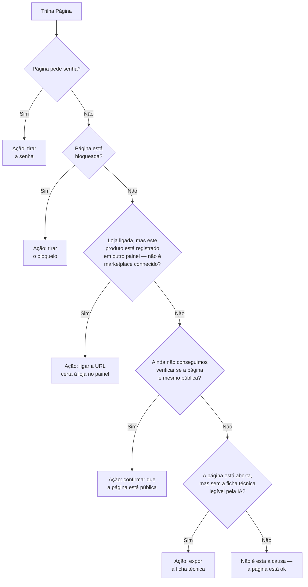

Esta trilha nunca vira uma lista genérica de SEO (FAQ, canonical, robots.txt) — é sempre um único movimento técnico e objetivo.

**Exemplo real (senha):** *"Esta URL está com senha. Sem a porta aberta, a IA não lê o produto. Esta semana: tire a senha da página do produto."*

**Exemplo real (sem ficha técnica):** *"O cadastro no Shopify já tem o produto. A página pública não expõe a ficha estruturada. Esta semana: exponha essa ficha em [URL do produto]."*

### 🟢 Trilha Produto — "o concorrente venceu na comparação"

Aqui o motor compara o produto da loja com o que a IA escolheu no lugar dele, numa ordem fixa de prioridade — a primeira diferença que for **real o suficiente** (não um empate técnico) vence e vira o passo da semana.

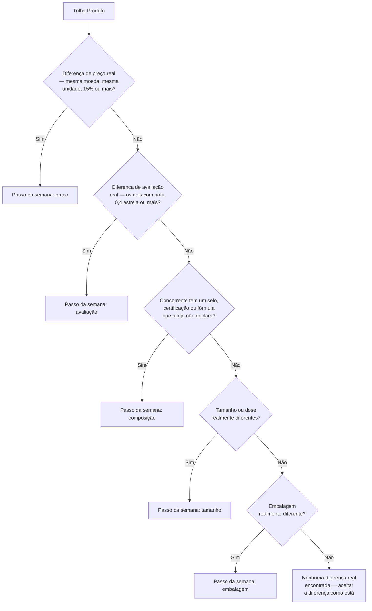

Duas travas evitam conclusões precipitadas:

- **Diferença pequena não compete.** 4,6 estrelas contra 4,8, ou um preço 3% mais caro, não é o motivo real de uma venda perdida — o motor ignora e passa pro próximo critério.
- **Sem oferta clara do concorrente, o motor espera.** Se a IA citou um concorrente mas sem produto específico, sem loja, ou de forma contraditória entre as várias perguntas, o motor não inventa uma comparação — marca que precisa de mais dados e não aponta um "vencedor" nesta rodada.

**Exemplo real:** *"Não foi o preço nem o prazo: ela escolheu o outro pela fórmula (Certificação NSF). Esta semana: não mude o produto e não copie a certificação no cadastro."*

### 🔴 Trilha Mídia — "o anúncio está desperdiçando dinheiro"

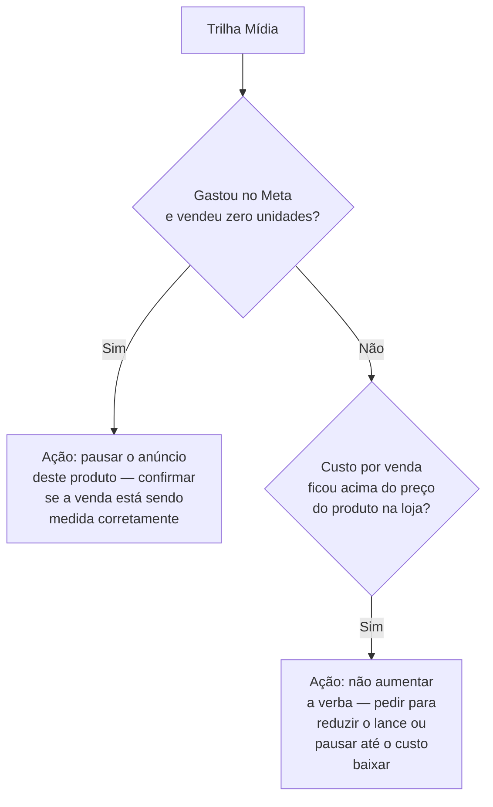

Só conta o Meta convencional (feed, Stories, catálogo) — Google Ads, Merchant Center e anúncios dentro de ferramentas de IA ainda não decidem a causa da semana (ficam para uma fase futura). Conteúdo e mudança de produto não resolvem um anúncio que não está vendendo — por isso, quando esta trilha é a causa, a ação é sempre na própria conta de mídia.

---

## 8. O tamanho do prejuízo

Em paralelo à árvore de decisão, o motor sempre calcula dois números — eles aparecem em qualquer uma das 4 trilhas, porque medem o impacto financeiro, não a causa.

1. **Lacuna em R$** — compara, na receita que a IA está gerando para a loja, a proporção de vezes que um concorrente foi citado contra a proporção de vezes que você foi citado. Se a IA nunca te citou em nenhuma pergunta, o cálculo usa o total de perguntas como base (pra não dividir por zero) — o número nunca fica negativo; é sempre um "piso" do prejuízo, nunca um teto.
2. **Clientes perdidos** — a lacuna em R$ dividida pelo ticket médio da loja. Uma estimativa de quantos clientes essa lacuna representa.
3. **Custo para compensar via mídia** — clientes perdidos × custo por venda no Meta. É a resposta para "quanto custaria comprar de volta, via anúncio, o que a visibilidade orgânica não está trazendo". **Não deve ser somado com a lacuna** — são duas óticas diferentes (quanto se perde vs. quanto custaria recuperar via anúncio).

---

## 9. Fim da linha

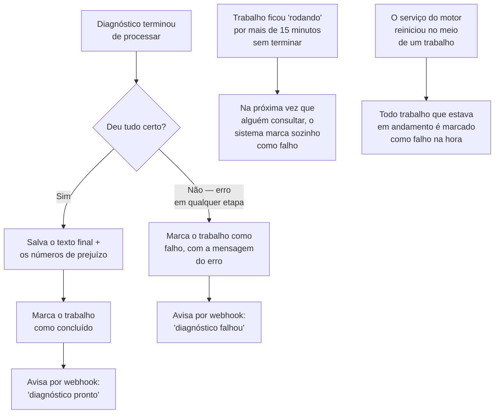

A mensagem que o fundador vê quando um trabalho trava sozinho é sempre a mesma: *"O diagnóstico parou antes de terminar. Tente de novo."*

---

## Onde cada peça deste mapa vive no código

| Seção deste mapa | Arquivo |
|---|---|
| Pedido + retrato do dia | `src/routes/v1/diagnostics.ts`, `src/services/day-photo.ts` |
| Validações de entrada | `src/services/diagnostic-input.ts` |
| Porta da loja aberta/fechada | `src/services/diagnostic-triage.ts` (`publicStorefrontUnreadable`) |
| Rodada de perguntas ao Gemini | `src/services/dominant-diagnostic-runner.ts` (`executeQuery`) |
| Produto da semana | `src/services/dominant-diagnostic-runner.ts` (`selectPrimarySku`, `selectDominantSku`) |
| Árvore de decisão | `src/services/diagnostic-triage.ts` (`computeTriage`) |
| Trilha Conteúdo | `src/services/llm-out-first-action.ts`, `src/services/founder-action-copy.ts` |
| Trilha Página | `src/services/pdp-week-judge.ts`, `src/services/pdp-out-first-action.ts` |
| Trilha Produto | `src/services/produto-week-judge.ts`, `src/services/produto-out-first-action.ts` |
| Trilha Mídia | `src/services/diagnostic-output.ts` (bloco final de `buildDiagnosticOutput`) |
| Tamanho do prejuízo | `src/services/revenue-gap-engine.ts` |
| Fim da linha / travas | `src/services/dominant-diagnostic-runner.ts` (`try/catch` final), `src/services/diagnostic-job-stale.ts` |

Para a lógica de roteamento na versão técnica completa (com nomes de função, ADRs e casos de teste), ver [`rint-app/docs/DIAGNOSIS-DOMINANT.md`](../../rint-app/docs/DIAGNOSIS-DOMINANT.md).
